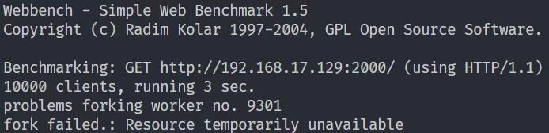
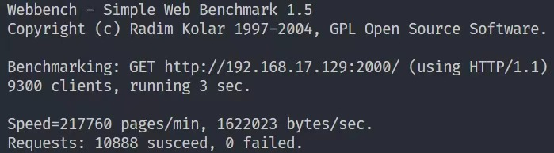

# MyWebserver
Linux下C++实现的高性能Web服务器，经webbench压力测试可以实现近万QPS

* 利用**I/O复用**技术Epoll(ET)与**线程池**实现多线程的Reactor高并发模型
* 使用**状态机**解析HTTP请求报文，支持解析**GET**和**POST**请求
* 利用**RAII**机制实现了数据库连接池，减少连接开销，同时实现了用户**注册**和**登录**功能，可以请求**图片和视频文件**
* 利用**单例模式**与**阻塞队列**实现的**异步日志**系统，记录服务器运行状态
* 基于双向链表实现的**定时器**，关闭超时的非活动连接

## 项目启动
* 服务器环境
    * Ubuntu 22.04 LTS
    * mysql 8.0.29

* 浏览器环境
    * Windows、Linux
    * Chrome
    * FireFox

* MySQL

    ```C++
    // 建立yourdb库
    create database yourdb;

    // 创建user表
    USE yourdb;
    CREATE TABLE user(
        username char(50) NULL,
        passwd char(50) NULL
    )ENGINE=InnoDB;

    // 添加数据
    INSERT INTO user(username, passwd) VALUES('name', 'passwd');
    ```

* 修改main.c中的数据库初始化信息

    ```C++
    // "root", "root"修改为服务器数据库的登录名和密码
    // "yourdb"修改为数据库名称
    connPool->init("localhost", "root", "root", "yourdb", 3306, 8);
    ```

* 修改http_conn.cpp中的root路径

    ```C++
	// 修改为root文件夹所在路径
    const char* doc_root="/home/xxx/MyWebserver/root";
    ```

* 修改main.cpp中的服务器ip

    ```C++
	// ip修改为服务器ip
    const char* ip = "192.168.17.129";
    ```

* 生成server

    ```C++
    make 
    ```

* 启动server

    ```C++
    ./run port
    ```

* 浏览器
    ```C++
    ip:port
    ```


## 文件目录
```
.
├── CGImysql
│   ├── sql_connection_pool.cpp
│   ├── sql_connection_pool.h
│   └── test_mysql.cpp
├── http
│   ├── http_conn.cpp
│   └── http_conn.h
├── LICENSE
├── lock
│   └── locker.h
├── log
│   ├── block_queue.h
│   ├── log.cpp
│   └── log.h
├── main.cpp
├── makefile
├── README.md
├── root
├── run
├── test
│   ├── stress_test.cpp
│   ├── test
│   └── webbench-1.5
├── threadpool
│   └── threadpool.h
└── timer
    └── lst_timer.h
```

## 压力测试
* 环境：虚拟机Ubuntu 22.04 LTS 内存：4GB



因虚拟机内存原因webbench最多可以fork约9300个子进程进行并发访问



## 更新历史
* (2022/07/11) 服务器经压力测试能够承受接近上万并发访问

* (2022/07/08) 添加数据库连接池，新增解析POST请求，实现web端用户注册和登录功能，能够请求服务器上的图片和视频文件

* (2022/07/02) 添加异步日志系统，记录服务器运行状态

* (2022/06/24) 添加了定时器处理非活动连接

* (2022/06/18) 一个基本的Webserver：线程池 + epoll ET + Reactor并发模式 + 状态机解析HTTP报文（仅支持GET）

## 致谢
《Linux高性能服务器编程》，游双著

TinyWebServer@qinguoyi: https://github.com/qinguoyi/TinyWebServer